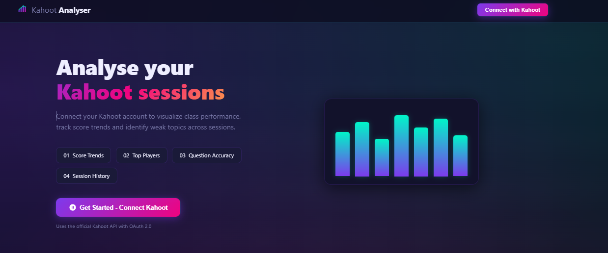

# Kahoot Class Analyzer Template

Professional, frontend-only template for building a Kahoot session analytics dashboard.

This repository is intentionally minimal and easy to fork for GitHub projects, portfolios, or classroom analytics prototypes.

## Table of Contents

1. Overview
2. Current Features
3. Project Files
4. Quick Start
5. OAuth Configuration (Kahoot)
6. Demo Mode
7. Screenshots (You Can Add Yours)
8. Security Model
9. What Is Included vs Not Included
10. Troubleshooting
11. Recommended Next Improvements

## Overview

This template provides:

- A responsive analytics dashboard UI
- OAuth 2.0 PKCE flow structure for Kahoot authentication
- Multiple data visualizations with Chart.js
- Input sanitation and basic frontend hardening
- Mock data fallback for local development

## Current Features

- KPI cards (sessions, players, score, accuracy)
- Session list with live search
- Average score trend chart
- Question accuracy chart
- Score distribution chart
- Participation chart
- Learning momentum chart
- Session rhythm chart (weekday distribution)
- Session quality radar chart
- Performance map bubble chart
- Top players ranking

## Project Files

Current repository structure:

```text
Kahoot Analyse/
  app.js
  index.html
  style.css
  README.md
  screenshots/
    dashboard-hero.png
  assets/
    screenshots/
      .gitkeep
```

File responsibilities:

- `index.html`: app structure, metadata, script/style loading
- `style.css`: layout, theme, animations, responsive rules
- `app.js`: OAuth flow, data normalization, chart rendering, UI updates
- `screenshots/`: README images currently used by this repository
- `assets/screenshots/`: optional placeholder folder for extra visual assets

## Quick Start

1. Clone or download this repository.
2. Open the project folder.
3. Serve the folder with a local static server.
4. Open the app URL in your browser.

Example:

```bash
npx serve .
```

You can also use VS Code Live Server.

## OAuth Configuration (Kahoot)

Edit `app.js` and update the `CONFIG` object:

```js
const CONFIG = {
  CLIENT_ID: 'YOUR_CLIENT_ID',
  REDIRECT_URI: 'http://localhost:5500/',
  SCOPE: 'openid profile email reports:read kahoots:read',
  API_BASE: 'https://api.kahoot.com/v2',
  AUTH_URL: 'https://create.kahoot.it/oauth/authorize',
  TOKEN_URL: 'https://create.kahoot.it/oauth/token',
};
```

Important:

- Redirect URI must match exactly between Kahoot app settings and `app.js`.
- If your local port changes, update both sides.

## Demo Mode

If `CLIENT_ID` is still `YOUR_CLIENT_ID`, the app runs in demo mode automatically.

In demo mode, mock sessions are generated in `app.js` and all dashboard components remain functional.

## Screenshots

Dashboard Hero:



You can add more images in `screenshots/` and reference them the same way.

## Security Model

Current frontend protections included in this template:

- CSP and related browser policies via meta tags in `index.html`
- Session token storage in `sessionStorage` (not `localStorage`)
- OAuth callback parameter validation
- Input/text sanitization for rendered API values
- URL validation for user avatar rendering

Production recommendation:

- Move OAuth token exchange and refresh to a backend service.
- Keep tokens server-side whenever possible.
- Enforce security headers at web server or CDN level.

## Security Issues Fixed In This Template

The following risks were identified and corrected in the current codebase.

1. Token persistence risk in browser storage
- Previous risk: long-lived token persistence in `localStorage` can increase exposure in case of browser compromise or injected script.
- Fix applied: token storage moved to `sessionStorage` to reduce persistence across browser sessions.

2. Weak OAuth callback validation
- Previous risk: malformed callback parameters could be processed.
- Fix applied: strict validation for `code` and `state` formats before processing callback flow.

3. Incomplete OAuth state verification path
- Previous risk: callback could continue when verifier/state data is missing or invalid.
- Fix applied: callback now aborts on mismatch or missing verifier and returns to auth screen safely.

4. Untrusted API data rendered in UI
- Previous risk: unsafe text fields from external data could lead to rendering issues.
- Fix applied: centralized text sanitization and bounded length checks before UI rendering.

5. Unsafe external avatar URL handling
- Previous risk: unvalidated avatar URLs could point to unsupported schemes.
- Fix applied: avatar URL validation now allows only http/https and rejects invalid values.

6. Overly permissive API response assumptions
- Previous risk: unexpected payload shape could break normalization logic.
- Fix applied: array checks and numeric normalization added before mapping reports, players, and questions.

7. Excessive report processing surface
- Previous risk: large payloads increase processing and attack surface.
- Fix applied: report list is bounded by `MAX_REPORTS` before normalization.

8. Missing frontend security policy declarations
- Previous risk: no explicit browser policy constraints in static template.
- Fix applied: CSP meta policy, referrer policy, permission policy, and nosniff metadata added in HTML.

9. Mixed-content and framing hardening gaps
- Previous risk: potential downgrade or embedding vectors in permissive environments.
- Fix applied: CSP directives now include `upgrade-insecure-requests`, `block-all-mixed-content`, and `frame-ancestors 'none'`.

10. Unsanitized search input handling
- Previous risk: direct filtering on raw input.
- Fix applied: search text now passes sanitation and length bounding before filtering.

Verification status:

- No editor/runtime errors reported after these hardening changes.

## What Is Included vs Not Included

Included now:

- Frontend template
- Dashboard UI and charts
- OAuth client flow structure
- Mock-data local mode

Not included now:

- Backend API/BFF
- Persistent database
- Automated tests
- CI pipeline

## Troubleshooting

If login does not work:

1. Check `CLIENT_ID` in `app.js`.
2. Confirm redirect URI exact match.
3. Confirm your Kahoot app has access to needed scopes/endpoints.
4. Open browser DevTools and inspect network errors for OAuth/API calls.

If charts do not appear:

1. Confirm external CDN scripts are loaded.
2. Confirm browser is not blocking content due to policy/extensions.
3. Run in demo mode first to validate frontend rendering.

## Recommended Next Improvements

1. Add backend token handling.
2. Add export options (CSV/PDF/image).
3. Add tests for data normalization and chart datasets.
4. Add CI checks (lint and build verification).
5. Add deployment documentation.
